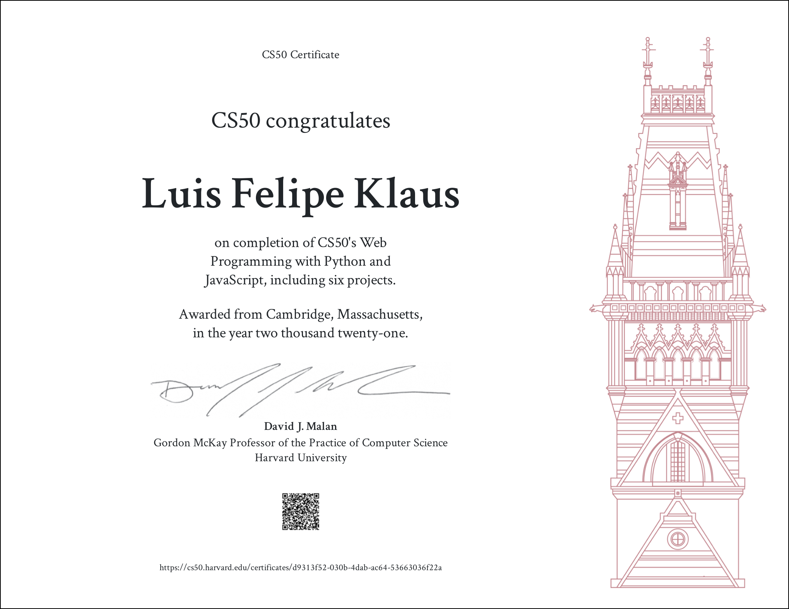

# CS50WEB Projects

This repository contains the complete set of CS50 Web Programming with Python and JavaScript project implementations.

If you are taking the course please consider reading about the [CS50's Academic Honesty rules](https://cs50.harvard.edu/college/2021/fall/syllabus/#academic-honesty). Also consider that the course is graded by humans and inforces a zero tolerance plagiarism policy. 

## Course Info

* CS50's Web Programming with Python and Javascript

* Harvard University

* https://cs50.harvard.edu/web/2020/

## Course Certificate

## Professional Certificate

* Computer Science for Artificial Intelligence
[Professional Certificate](https://courses.edx.org/certificates/6d6092922409434d8b4d1b15ce31e9ad).
